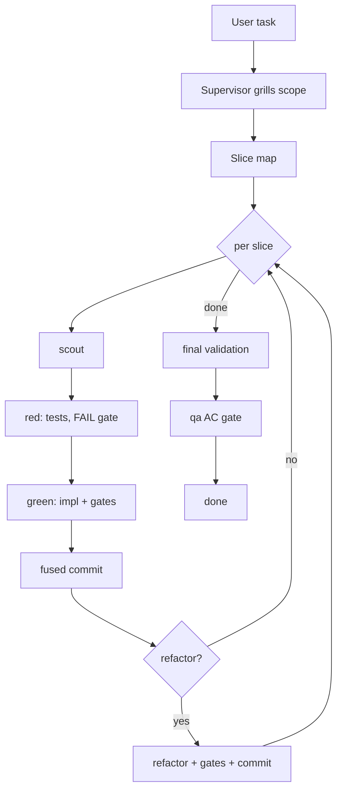

# setup-supervisor

Bootstraps an opencode **Supervisor mode** in any project — a planning/delegating/validating supervisor agent, a subagent fleet, protocol skills, and optional memory plugin. Machine-agnostic: all models/commands are placeholders filled at install time from your existing config or interactive prompts.

## What you get

| Piece | File(s) | What it does |
|-------|---------|--------------|
| Supervisor agent | `AGENTS.md` protocol + `opencode.jsonc` entry | Plans, delegates via Task, runs gates, never edits code |
| Stack agents | `develop-frontend.md`, `develop-backend.md`, `develop-service-bus.md` | Implement features per stack; frontend fetches Figma design via MCP itself; per-step tests scoped to touched files |
| Generic agents | `qa.md`, `verifier.md`, `general-coding.md` | AC verification, gate running, fallback coding |
| Protocol skills | `grilling/`, `tdg/`, `wayfinder/` | Scope interrogation, red-green-refactor loops, large-work mapping |
| Memory plugin (opt-in) | `reference/memory-plugin.md` | Cross-session lessons (do/dont/context) |
| Figma MCP (opt-in) | ask-install step 6.6 | Design-to-code workflow |

## Setup

Trigger: tell your agent `setup supervisor` / `bootstrap supervisor mode` / `create subagents` (skill lives in `~/.agents/skills/setup-supervisor` or your skills dir).

Numbered install flow:

1. **Scope**: project-only `.opencode/` vs global `~/.config/opencode/`
2. **Detect project state**: existing agents, test/lint commands, stacks
3. **New-project interview** (only when nothing to harvest)
4. **Model assignment**: harvest existing models → tier suggestions (cheap/mid/strong) → per-agent confirm/override
5. **Write agent files** (placeholders filled) + supervisor entry in `opencode.jsonc` (`prompt: {file:...}` → protocol AGENTS.md)
6. **Optional**: figma MCP ask-install (stdio+API key or desktop Dev Mode URL)
7. **Copy skills**, opt-in memory plugin, config snippets
8. **Post-setup checklist** + drift report

**Re-runs are safe**: every step verifies existing config, merges only missing keys, never rewrites; outdated entries surface in a drift report for user approval.

## Structure

```
setup-supervisor/
├── SKILL.md                  # Install wizard: interview, detection, write steps
├── reference/                # Deep-dive docs (detection rules, interview, config snippets, memory plugin)
├── templates/
│   ├── protocol/AGENTS.md    # Supervisor protocol (version-marked)
│   ├── agents/
│   │   ├── stack/            # develop-frontend / develop-backend / develop-service-bus
│   │   └── generic/          # qa / verifier / general-coding
│   └── skills/               # grilling / tdg / wayfinder (vendored)
```

## How it runs



- Per-step tests scoped to touched files/packages; full suites only at final validation
- Commits by subagents only (`[Author] type: description`)
- Supervisor never edits code

## Hard rules

- **Machine-agnostic**: no real model IDs or commands — placeholders filled at install
- **Never echo API keys** or secrets
- **Templates version-marked**, installed copies never auto-update (re-run to sync)
- **jsonc edits preserve comments** — merge, don't rewrite
